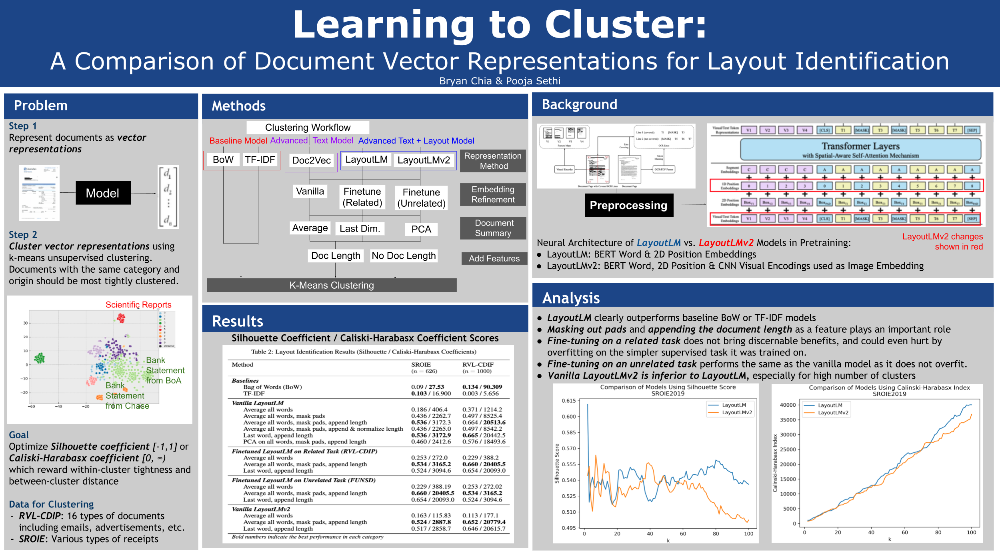

# Document Clustering
This is a library for _clustering_ documents in an _unsupervised_ fashion.

Check out the 4-minute video explanation [here](https://www.loom.com/share/621cf0663f8b4bb7b34f1046825bdf29) and paper [here](http://cs231n.stanford.edu/reports/2022/pdfs/27.pdf).



This extends the work done in [doc-clustering](https://github.com/poojasethi/doc-clustering) to use visual features of documents!

## Getting started

### Install dependencies in a new conda environment.
`conda env create --name doc-clustering --file=doc-clustering.yml`

Once you've created the environment, you can activate it using:
`conda activate doc-clustering`

If you're using an M1 (Apple Silicon), you'll need to use Minforge in order to use TensorFlow: https://developer.apple.com/metal/tensorflow-plugin/

Alternatively, you can also create your own, fresh environment:
`conda env create --name doc-clustering python=3.8`

And then manually find and install the missing dependencies by running:
`python clustering.py -h`

### Download datasets
Datasets are available for download [here](https://drive.google.com/drive/folders/1yjovBe7blrTmarF39wk6P_gUwmT0bfk-?usp=sharing).

And should be stored with the following directory structure and names:
```
datasets/rvl-cdip/
datasets/sroie2019/
```
### Download finetuned models.
Models are available for download [here](https://drive.google.com/drive/folders/10DERNJwX_3q4OQ9T-ZPWiFGX8ZKAYDwv?usp=sharing).

And should be stored with the following directory structure and names:
```
finetuned_models/finetuned_related_lmv1/
finetuned_models/finetuned_unrelated_lmv2/
```
### Download embeddings and results from paper.
Prepared document embeddings and experiment results are [here](https://drive.google.com/file/d/1kIEQjUhfW5TdL4Zc4pYW5YD7QYXVBUSU/view?usp=sharing).

And should be stored with the following directory name:
```
results/
```

## Training and running models.

### Get document embeddings from LayoutLM (and variants).
`mkdir embeddings/`

`python get_hidden_states.py -r <rivlets_dir> <model_type>`

`python get_hidden_states.py -r datasets/rvl-cdip/rvl_cdip_processed/base/rivlets/ vanilla_lmv1`

### Run unsupervised clustering
Run one of the commands from EXPERIMENTS.md, or `python clustering.py --help` for example usage.

Add the `--debug` flag to get interactive visualizations as well. Example commands:
```
mkdir -p results/sroie2019/resnet/

python clustering.py -p datasets/sroie2019/ \
	-r resnet \
	-o results/sroie2019/resnet/ \
	--debug
```

```
mkdir -p results/sroie2019/rivlet_count/

python clustering.py -p datasets/sroie2019/ \
	-r rivlet_count \
	-o results/sroie2019/rivlet_count/ \
	--debug
```

```
mkdir -p results/sroie2019/vanilla_lmv2/average_all_words_mask_pads/

python clustering.py -p datasets/sroie2019/ \
	-r vanilla_lmv2 \
	-e 769 \
	-s average_all_words_mask_pads \
	-o results/sroie2019/vanilla_lmv2/average_all_words_mask_pads \
	--debug
```


